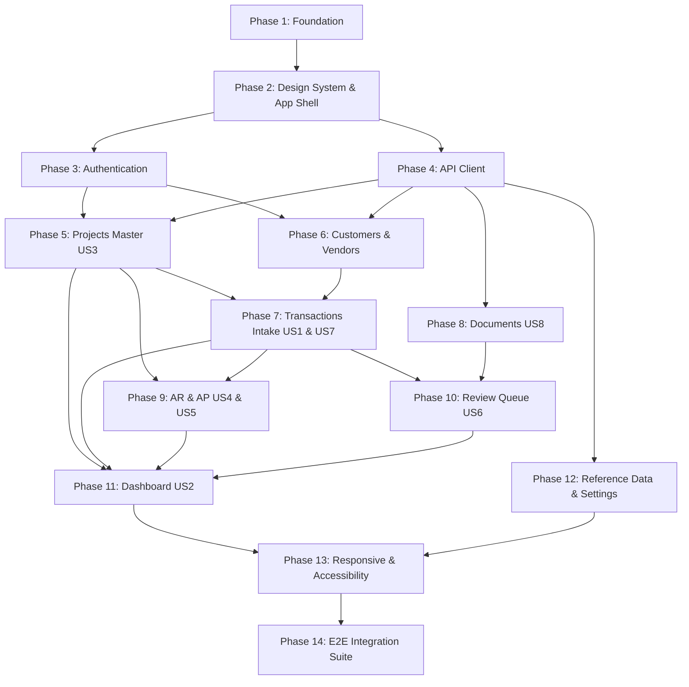

# Implementation Tasks: Web SaaS Application — Core Operational UI

**Feature Branch**: `003-core-operational-ui`  
**Specification**: [specs/003-core-operational-ui/spec.md](file:///c:/Projects/financial-saas/specs/003-core-operational-ui/spec.md)  
**Implementation Plan**: [specs/003-core-operational-ui/plan.md](file:///c:/Projects/financial-saas/specs/003-core-operational-ui/plan.md)  
**Data Model**: [specs/003-core-operational-ui/data-model.md](file:///c:/Projects/financial-saas/specs/003-core-operational-ui/data-model.md)  
**API Contract**: [specs/003-core-operational-ui/contracts/api-client-spec.md](file:///c:/Projects/financial-saas/specs/003-core-operational-ui/contracts/api-client-spec.md)  
**Quickstart**: [specs/003-core-operational-ui/quickstart.md](file:///c:/Projects/financial-saas/specs/003-core-operational-ui/quickstart.md)

---

## Phase 1: Frontend Foundation

**Purpose**: Project initialization, toolchain setup, TypeScript configuration, testing framework, and build environment.

- [X] T001 Initialize React 19 + TypeScript + Vite project structure in `frontend/`
- [X] T002 [P] Configure TailwindCSS v4 and typography utilities in `frontend/src/index.css` and `frontend/vite.config.ts`
- [X] T003 [P] Configure TypeScript strict compiler options, path aliases (`@/*`), and environment declarations in `frontend/tsconfig.json`
- [X] T004 [P] Configure Vitest, React Testing Library, and jsdom in `frontend/vitest.config.ts` and `frontend/tests/setup.ts`
- [X] T005 [P] Setup environment variable configuration (`VITE_API_BASE_URL`) in `frontend/.env.example`
- [X] T006 [P] Configure package scripts for dev, build, test, and typecheck in `frontend/package.json`

---

## Phase 2: Design System & App Shell

**Purpose**: Build reusable UI primitives, typography, status badges, data table components, and application shell layout.

- [X] T007 [P] Implement core UI primitive components (Button, Input, Select, Card, Badge) in `frontend/src/components/ui/`
- [X] T008 [P] Implement Indonesian Rupiah formatting utility `formatIDR` and date formatting in `frontend/src/utils/formatters.ts`
- [X] T009 [P] Implement StatusBadge component for WorkflowStatus, ProjectStatus, and CollectionStatus in `frontend/src/components/ui/StatusBadge.tsx`
- [X] T010 [P] Implement reusable Modal and ConfirmDialog components in `frontend/src/components/ui/Modal.tsx` and `ConfirmDialog.tsx`
- [X] T011 [P] Implement generic dense DataTable component with sorting, pagination, and search in `frontend/src/components/tables/DataTable.tsx`
- [X] T012 [P] Implement feedback state components (SkeletonLoader, EmptyState, Toast notifications) in `frontend/src/components/feedback/`
- [X] T013 Implement AppLayout shell with persistent responsive sidebar, top navigation, tenant header, and breadcrumbs in `frontend/src/components/layout/AppLayout.tsx`

---

## Phase 3: Authentication & Session Management

**Purpose**: Login page, JWT session storage, reactive auth context, and role-based route guards.

- [X] T014 Implement AuthContext, useAuth hook, and token persistence in `frontend/src/store/AuthContext.tsx`
- [X] T015 Implement ProtectedRoute component enforcing authentication and role permissions in `frontend/src/router/ProtectedRoute.tsx`
- [X] T016 Implement LoginPage view with email/password form and error alert in `frontend/src/pages/auth/LoginPage.tsx`
- [X] T017 Implement User Profile dropdown and Logout trigger in top navigation bar in `frontend/src/components/layout/UserNav.tsx`
- [X] T018 Unit test for AuthContext, token expiration redirect, and role permission checks in `frontend/tests/components/AuthContext.test.tsx`

---

## Phase 4: Typed API Client & Interceptors

**Purpose**: Centralized Axios client, typed API modules, request/response interceptors, and error normalization.

- [X] T019 Implement Axios instance with `Authorization: Bearer` and `X-Organization-ID` interceptors in `frontend/src/api/client.ts`
- [X] T020 Implement response error interceptor normalizing FastAPI 400/401/403/409/422 errors into user-friendly messages in `frontend/src/api/errorHandler.ts`
- [X] T021 [P] Implement TypeScript interfaces and DTOs matching backend OpenAPI schemas in `frontend/src/types/api.ts`
- [X] T022 [P] Implement Auth API service in `frontend/src/api/auth.ts`
- [X] T023 Setup TanStack Query client provider with optimistic cache policies in `frontend/src/api/queryClient.ts`

---

## Phase 5: User Story 3 — Project Master & Financial Tracking (Priority: P1)

**Goal**: Project listing, project creation, status transitions, contract variation orders, real-time cost breakdown, and profitability analytics.

- [X] T024 [P] [US3] Implement Project API client endpoints in `frontend/src/api/projects.ts`
- [X] T025 [P] [US3] Implement Project Form component with contract value and date validation in `frontend/src/components/forms/ProjectForm.tsx`
- [X] T026 [US3] Implement ProjectListPage with status filters, search, and derived billing/collection badges in `frontend/src/pages/projects/ProjectListPage.tsx`
- [X] T027 [US3] Implement ProjectCreatePage in `frontend/src/pages/projects/ProjectCreatePage.tsx`
- [X] T028 [US3] Implement ProjectDetailPage with Contract Overview, Variation Order modal, and Status Update action in `frontend/src/pages/projects/ProjectDetailPage.tsx`
- [X] T029 [US3] Implement Project Cost Breakdown & Profitability tab rendering 9 cost categories (`MAT`, `SUB`, `LAB`, etc.) and gross margin in `frontend/src/pages/projects/components/ProjectProfitabilityTab.tsx`

---

## Phase 6: Master Data — Customers & Vendors

**Purpose**: Manage counterparties (Customers & Vendors) with natural business terms and role-aware tagging.

- [X] T030 [P] Implement Counterparty API service in `frontend/src/api/master.ts`
- [X] T031 [P] Implement CounterpartyForm modal for Customer / Vendor creation in `frontend/src/components/forms/CounterpartyForm.tsx`
- [X] T032 Implement CustomerListPage with outstanding receivable metrics in `frontend/src/pages/master/CustomerListPage.tsx`
- [X] T033 Implement VendorListPage with outstanding payable metrics in `frontend/src/pages/master/VendorListPage.tsx`
- [X] T034 Implement CounterpartyDetailPage displaying active projects and transaction history in `frontend/src/pages/master/CounterpartyDetailPage.tsx`

---

## Phase 7: User Story 1 & 7 — Transaction Intake, History & Reversals (Priority: P1)

**Goal**: Intuitive transaction intake form without debit/credit exposure, multi-project split validation, transaction history, read-only posted state, and 3-step reversal modal.

- [X] T035 [P] [US1] Implement Transaction API service in `frontend/src/api/transactions.ts`
- [X] T036 [US1] Implement TransactionForm component supporting single-project default and dynamic multi-project split lines in `frontend/src/components/forms/TransactionForm.tsx`
- [X] T037 [US1] Implement client-side allocation sum reconciliation validation ($\sum \text{Allocations} == \text{Nominal}$) in `frontend/src/utils/transactionValidation.ts`
- [X] T038 [US1] Implement TransactionCreatePage in `frontend/src/pages/transactions/TransactionCreatePage.tsx`
- [X] T039 [US1] Implement TransactionListPage with filters by Status, Date, Project, and Transaction Type in `frontend/src/pages/transactions/TransactionListPage.tsx`
- [X] T040 [US7] Implement TransactionDetailPage rendering posted transactions strictly read-only in `frontend/src/pages/transactions/TransactionDetailPage.tsx`
- [X] T041 [US7] Implement TransactionReversalModal prompting for mandatory reversal reason and triggering reversal API in `frontend/src/components/transactions/TransactionReversalModal.tsx`

---

## Phase 8: User Story 8 — Document Evidence & Cryptographic Deduplication (Priority: P2)

**Goal**: Drag-and-drop document upload, in-browser PDF/image preview, and SHA-256 duplicate warning modal.

- [X] T042 [P] [US8] Implement Document API service in `frontend/src/api/documents.ts`
- [X] T043 [P] [US8] Implement FileDropzone component with progress indicators and file type validation in `frontend/src/components/forms/FileDropzone.tsx`
- [X] T044 [US8] Implement DocumentListPage and DocumentUploadPage in `frontend/src/pages/documents/`
- [X] T045 [US8] Implement DocumentPreviewModal supporting in-browser PDF and image zoom in `frontend/src/components/documents/DocumentPreviewModal.tsx`
- [X] T046 [US8] Implement DuplicateDocumentModal dialog triggered on 409 Conflict with direct link to existing record in `frontend/src/components/documents/DuplicateDocumentModal.tsx`

---

## Phase 9: User Story 4 & 5 — Accounts Receivable (AR) & Accounts Payable (AP) (Priority: P2)

**Goal**: Customer Invoices (AR) and Vendor Bills (AP) overview, due-date tracking, collection status badges, and payment allocation modals.

- [X] T047 [P] [US4] Implement Receivables & Payables API services in `frontend/src/api/receivables.ts` and `frontend/src/api/payables.ts`
- [X] T048 [US4] Implement ReceivablesPage listing customer invoices with Customer, Project, Due Date, Paid, Outstanding, and Collection Status in `frontend/src/pages/receivables/ReceivablesPage.tsx`
- [X] T049 [US4] Implement CustomerPaymentAllocationModal in `frontend/src/pages/receivables/components/CustomerPaymentAllocationModal.tsx`
- [X] T050 [US5] Implement PayablesPage listing vendor bills with Vendor, Project, Bill Date, Due Date, Paid, and Outstanding in `frontend/src/pages/payables/PayablesPage.tsx`
- [X] T051 [US5] Implement VendorPaymentAllocationModal in `frontend/src/pages/payables/components/VendorPaymentAllocationModal.tsx`
- [X] T052 [US5] Implement VendorAdvanceSettlementModal in `frontend/src/pages/payables/components/VendorAdvanceSettlementModal.tsx`

---

## Phase 10: User Story 6 — Review Queue & Ambiguity Resolution (Priority: P1)

**Goal**: Dedicated review workspace displaying multi-flag transactions, side-by-side document split view, flag resolution with mandatory notes, and role-based approval controls.

- [X] T053 [P] [US6] Implement Review Queue API service in `frontend/src/api/review.ts`
- [X] T054 [US6] Implement ReviewQueuePage with filterable flag badges (`AMOUNT_MISMATCH`, `DUPLICATE_SUSPECTED`, `PROJECT_UNKNOWN`, etc.) in `frontend/src/pages/review/ReviewQueuePage.tsx`
- [X] T055 [US6] Implement ReviewDrawer split-view showing transaction details alongside document preview in `frontend/src/pages/review/components/ReviewDrawer.tsx`
- [X] T056 [US6] Implement ResolveFlagModal requiring resolution notes and updating flag status in `frontend/src/pages/review/components/ResolveFlagModal.tsx`
- [X] T057 [US6] Implement ApprovalActionControls enforcing Manager authorization for sensitive transaction types in `frontend/src/pages/review/components/ApprovalActionControls.tsx`

---

## Phase 11: User Story 2 — Operational Executive Dashboard (Priority: P1)

**Goal**: High-level operational summary cards for Kas & Bank, Piutang (AR), Utang (AP), Proyek Aktif, and Antrean Review count.

- [X] T058 [P] [US2] Implement Dashboard API service in `frontend/src/api/dashboard.ts`
- [X] T059 [US2] Implement DashboardPage layout with 5 operational metric cards in `frontend/src/pages/dashboard/DashboardPage.tsx`
- [X] T060 [US2] Implement QuickActionsPanel for rapid navigation to Catat Transaksi, Buat Proyek, and Unggah Dokumen in `frontend/src/pages/dashboard/components/QuickActionsPanel.tsx`
- [X] T061 [US2] Implement RecentActivityTable showing latest transactions and pending review items in `frontend/src/pages/dashboard/components/RecentActivityTable.tsx`

---

## Phase 12: Reference Data & Settings

**Purpose**: Payment accounts management, Chart of Accounts tree view, user management, and audit log explorer.

- [X] T062 [P] Implement PaymentAccountsPage listing operational cash and bank accounts in `frontend/src/pages/master/PaymentAccountsPage.tsx`
- [X] T063 [P] Implement ChartOfAccountsPage rendering the standard contractor COA in read-only tree format in `frontend/src/pages/master/ChartOfAccountsPage.tsx`
- [X] T064 Implement OrganizationSettingsPage in `frontend/src/pages/settings/OrganizationSettingsPage.tsx`
- [X] T065 Implement UserManagementPage with role assignment table in `frontend/src/pages/settings/UserManagementPage.tsx`
- [X] T066 Implement AuditLogsPage with entity, action, and date range filters in `frontend/src/pages/settings/AuditLogsPage.tsx`

---

## Phase 13: Responsive Layout & Accessibility Hardening

**Purpose**: Mobile collapsible navigation, responsive tables, keyboard navigation, and WCAG accessibility standards.

- [X] T067 [P] Implement mobile collapsible drawer and responsive header hamburger toggle in `frontend/src/components/layout/MobileNav.tsx`
- [X] T068 [P] Implement responsive table horizontal scroll and mobile card view adaptations in `frontend/src/components/tables/DataTable.tsx`
- [X] T069 [P] Implement unsaved dirty form navigation guard hook `useDirtyFormGuard` in `frontend/src/hooks/useDirtyFormGuard.ts`
- [X] T070 [P] Implement keyboard focus ring styling, ARIA labels, and screen reader announcements in `frontend/src/components/ui/`

---

## Phase 14: End-to-End User Flow Integration Suite & Verification

**Purpose**: Component integration tests covering all 10 primary user journeys and verification against live backend.

- [X] T071 [P] Component test for Login, token storage, and protected route redirection in `frontend/tests/pages/LoginFlow.test.tsx`
- [X] T072 [P] Component test for Transaction Entry, multi-project split validation, and submit in `frontend/tests/pages/TransactionFlow.test.tsx`
- [X] T073 [P] Component test for Review Queue multi-flag resolution and manager approval in `frontend/tests/pages/ReviewFlow.test.tsx`
- [X] T074 [P] Component test for Posted Transaction immutability and Reversal modal in `frontend/tests/pages/ReversalFlow.test.tsx`
- [X] T075 Execute full Quickstart verification scenarios A through G per `quickstart.md` and verify clean build/typecheck in `frontend/`

---

## Dependencies & Execution Order

---

## Parallel Execution Opportunities

- **Phase 1 & 2**: UI primitives (`T007`, `T008`, `T009`, `T010`, `T011`, `T012`) can all be built in parallel.
- **Phase 5 & 6**: Projects (`T024-T029`) and Counterparties (`T030-T034`) can proceed in parallel.
- **Phase 8 & 9**: Document upload (`T042-T046`) and AR/AP tables (`T047-T052`) can proceed in parallel.
- **Phase 14**: All integration tests (`T071-T074`) can execute in parallel.
