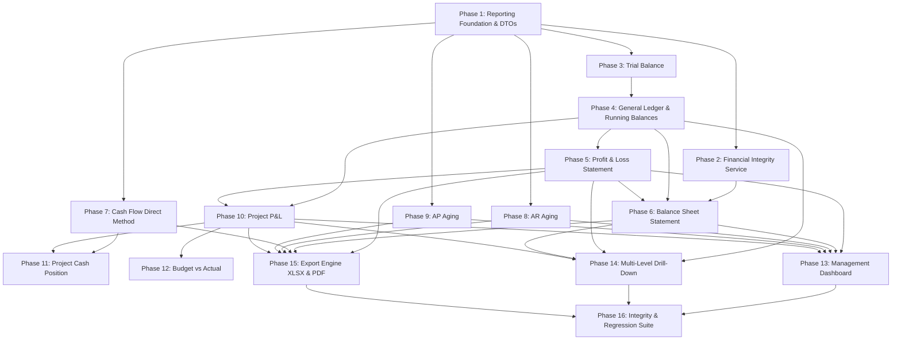

# Implementation Tasks: Financial Reporting & Management Dashboard

**Feature Branch**: `004-financial-reporting-dashboard`  
**Specification**: [specs/004-financial-reporting-dashboard/spec.md](file:///c:/Projects/financial-saas/specs/004-financial-reporting-dashboard/spec.md)  
**Implementation Plan**: [specs/004-financial-reporting-dashboard/plan.md](file:///c:/Projects/financial-saas/specs/004-financial-reporting-dashboard/plan.md)  
**Research & Decisions**: [specs/004-financial-reporting-dashboard/research.md](file:///c:/Projects/financial-saas/specs/004-financial-reporting-dashboard/research.md)  
**Data Model**: [specs/004-financial-reporting-dashboard/data-model.md](file:///c:/Projects/financial-saas/specs/004-financial-reporting-dashboard/data-model.md)  
**API Contract**: [specs/004-financial-reporting-dashboard/contracts/reporting-api-spec.yaml](file:///c:/Projects/financial-saas/specs/004-financial-reporting-dashboard/contracts/reporting-api-spec.yaml)  
**Quickstart**: [specs/004-financial-reporting-dashboard/quickstart.md](file:///c:/Projects/financial-saas/specs/004-financial-reporting-dashboard/quickstart.md)

---

## Phase 1: Reporting Foundation & DTO Schemas

**Purpose**: Establish backend reporting schema architecture, temporal filters, account grouping mappings, and multi-tenant isolation helpers.

- [X] T001 [P] Create reporting Pydantic request and response schemas in `backend/src/schemas/reporting.py`
- [X] T002 [P] Implement temporal period resolver utility (Monthly, Quarterly, Yearly, Custom) in `backend/src/services/reporting/period_helper.py`
- [X] T003 [P] Implement Chart of Account SAK category classifier and account normal balance mappings in `backend/src/services/reporting/coa_mapping.py`
- [X] T004 [P] Create base reporting query builder enforcing `organization_id` isolation in `backend/src/services/reporting/base.py`
- [X] T005 [P] Implement frontend TypeScript reporting interfaces in `frontend/src/types/reporting.ts`

---

## Phase 2: Financial Integrity Diagnostic Service

**Purpose**: Build the core diagnostic engine validating $\text{Assets} = \text{Liabilities} + \text{Equity}$, $\sum \text{Debit} == \sum \text{Credit}$, and AR/AP sub-ledger consistency.

- [X] T006 [P] Implement `IntegrityService` with 5 mandatory financial balance diagnostics in `backend/src/services/reporting/integrity_service.py`
- [X] T007 [P] Unit test for `IntegrityService` catching unbalanced journal mocks in `backend/tests/unit/test_integrity_service.py`
- [X] T008 Implement integrity diagnostic REST endpoint in `backend/src/api/v1/reports.py`
- [X] T009 [P] Implement `IntegrityAlertBanner` component for blocking financial alerts in `frontend/src/components/reports/IntegrityAlertBanner.tsx`
- [X] T010 Unit test for `IntegrityAlertBanner` rendering blocking alerts in `frontend/tests/components/IntegrityAlertBanner.test.tsx`

---

## Phase 3: Neraca Saldo (Trial Balance)

**Purpose**: Deliver dynamic Trial Balance computing opening, period movements, and closing balances from posted journal lines.

- [X] T011 [P] Implement `TrialBalanceService` aggregating `JournalLine` debits/credits in `backend/src/services/reporting/trial_balance_service.py`
- [X] T012 [P] Unit test for Trial Balance equality ($\sum \text{Debet} == \sum \text{Kredit}$) in `backend/tests/unit/test_trial_balance_service.py`
- [X] T013 Implement Trial Balance endpoint `GET /reports/trial-balance` in `backend/src/api/v1/reports.py`
- [X] T014 [P] Implement Trial Balance API client service in `frontend/src/api/reports.ts`
- [X] T015 Implement `TrialBalancePage` view in `frontend/src/pages/reports/TrialBalancePage.tsx`

---

## Phase 4: Buku Besar (General Ledger) & Running Balances

**Purpose**: Deliver General Ledger explorer with account filtering, chronological ordering, and calculated running balances.

- [X] T016 [P] Implement `GeneralLedgerService` computing dynamic running balances in `backend/src/services/reporting/gl_service.py`
- [X] T017 [P] Unit test for GL running balance calculations and backdated entry handling in `backend/tests/unit/test_gl_service.py`
- [X] T018 Implement General Ledger endpoint `GET /reports/general-ledger` in `backend/src/api/v1/reports.py`
- [X] T019 Implement `GeneralLedgerPage` with account dropdown and date filters in `frontend/src/pages/reports/GeneralLedgerPage.tsx`
- [X] T020 [P] Component test for `GeneralLedgerPage` rendering running balances in `frontend/tests/pages/GeneralLedgerPage.test.tsx`

---

## Phase 5: Laporan Laba Rugi (Profit & Loss Statement)

**Purpose**: Deliver SAK contractor Profit & Loss statement with hierarchical grouping (*Pendapatan*, *HPP*, *Laba Kotor*, *Beban Operasional*, *Laba Bersih*).

- [X] T021 [P] Implement `ProfitLossService` aggregating period revenues and direct/indirect costs in `backend/src/services/reporting/pl_service.py`
- [X] T022 [P] Unit test for P&L gross profit, operating profit, and net profit math in `backend/tests/unit/test_pl_service.py`
- [X] T023 Implement Profit & Loss endpoint `GET /reports/profit-loss` in `backend/src/api/v1/reports.py`
- [X] T024 Implement `ProfitLossPage` view with comparative columns in `frontend/src/pages/reports/ProfitLossPage.tsx`
- [X] T025 [P] Component test for `ProfitLossPage` period selection in `frontend/tests/pages/ProfitLossPage.test.tsx`

---

## Phase 6: Laporan Neraca (Balance Sheet Statement)

**Purpose**: Deliver standard contractor Balance Sheet as-of date linked to current-year earnings with mandatory balancing validation.

- [X] T026 [P] Implement `BalanceSheetService` aggregating cumulative asset, liability, and equity accounts in `backend/src/services/reporting/balance_sheet_service.py`
- [X] T027 [P] Unit test for Balance Sheet $\text{Assets} = \text{Liabilities} + \text{Equity}$ invariant in `backend/tests/unit/test_balance_sheet_service.py`
- [X] T028 Implement Balance Sheet endpoint `GET /reports/balance-sheet` in `backend/src/api/v1/reports.py`
- [X] T029 Implement `BalanceSheetPage` view with balance status badges in `frontend/src/pages/reports/BalanceSheetPage.tsx`
- [X] T030 [P] Component test for `BalanceSheetPage` integrity indicator in `frontend/tests/pages/BalanceSheetPage.test.tsx`

---

## Phase 7: Laporan Arus Kas (Cash Flow - Direct Method)

**Purpose**: Deliver Cash Flow statement derived from cash/bank movements categorized into *Operasi*, *Investasi*, and *Pendanaan*.

- [X] T031 [P] Implement `CashFlowService` classifying cash/bank movements in `backend/src/services/reporting/cash_flow_service.py`
- [X] T032 [P] Unit test for Cash Flow Direct Method classifications in `backend/tests/unit/test_cash_flow_service.py`
- [X] T033 Implement Cash Flow endpoint `GET /reports/cash-flow` in `backend/src/api/v1/reports.py`
- [X] T034 Implement `CashFlowPage` view in `frontend/src/pages/reports/CashFlowPage.tsx`
- [X] T035 [P] Component test for `CashFlowPage` category rendering in `frontend/tests/pages/CashFlowPage.test.tsx`

---

## Phase 8: Laporan Umur Piutang (AR Aging)

**Purpose**: Deliver Accounts Receivable Aging report based on effective invoice due dates across standard aging buckets.

- [X] T036 [P] Implement `ARAgingService` bucketing customer invoices by due date in `backend/src/services/reporting/ar_aging_service.py`
- [X] T037 [P] Unit test for AR aging buckets and partial payment allocations in `backend/tests/unit/test_ar_aging_service.py`
- [X] T038 Implement AR Aging endpoint `GET /reports/receivables-aging` in `backend/src/api/v1/reports.py`
- [X] T039 Implement `ARAgingPage` view with overdue alert indicators in `frontend/src/pages/reports/ARAgingPage.tsx`
- [X] T040 [P] Component test for `ARAgingPage` bucket filtering in `frontend/tests/pages/ARAgingPage.test.tsx`

---

## Phase 9: Laporan Umur Utang (AP Aging)

**Purpose**: Deliver Accounts Payable Aging report based on vendor bill due dates and unsettled cash advances.

- [X] T041 [P] Implement `APAgingService` bucketing vendor bills and advance settlements in `backend/src/services/reporting/ap_aging_service.py`
- [X] T042 [P] Unit test for AP aging buckets and advance reconciliations in `backend/tests/unit/test_ap_aging_service.py`
- [X] T043 Implement AP Aging endpoint `GET /reports/payables-aging` in `backend/src/api/v1/reports.py`
- [X] T044 Implement `APAgingPage` view in `frontend/src/pages/reports/APAgingPage.tsx`
- [X] T045 [P] Component test for `APAgingPage` in `frontend/tests/pages/APAgingPage.test.tsx`

---

## Phase 10: Laporan Profitabilitas Proyek (Project P&L)

**Purpose**: Deliver Project Profitability report calculating revenue recognized minus 9-category actual project costs.

- [X] T046 [P] Implement `ProjectProfitabilityReportService` aggregating project dimensions in `backend/src/services/reporting/project_reporting_service.py`
- [X] T047 [P] Unit test for project revenue, 9 cost categories, and gross margin math in `backend/tests/unit/test_project_reporting_service.py`
- [X] T048 Implement Project Profitability report endpoint `GET /reports/project-profitability` in `backend/src/api/v1/reports.py`
- [X] T049 Implement `ProjectProfitabilityPage` with cost category breakdown tables in `frontend/src/pages/reports/ProjectProfitabilityPage.tsx`
- [X] T050 [P] Component test for `ProjectProfitabilityPage` in `frontend/tests/pages/ProjectProfitabilityPage.test.tsx`

---

## Phase 11: Posisi Kas Proyek (Project Cash Position)

**Purpose**: Deliver Project Cash Position report tracking project cash inflow, cash outflow, and net cash surplus/deficit.

- [X] T051 [P] Implement Project Cash Position calculation logic in `backend/src/services/reporting/project_reporting_service.py`
- [X] T052 Implement Project Cash Position endpoint `GET /reports/project-cash` in `backend/src/api/v1/reports.py`
- [X] T053 Implement `ProjectCashPositionPage` view with liquidity warning banners in `frontend/src/pages/reports/ProjectCashPositionPage.tsx`
- [X] T054 [P] Component test for `ProjectCashPositionPage` in `frontend/tests/pages/ProjectCashPositionPage.test.tsx`

---

## Phase 12: Anggaran vs Realisasi (Budget vs Actual)

**Purpose**: Deliver Budget vs Actual report with variance analysis and graceful handling when budget is unassigned.

- [X] T055 [P] Implement `BudgetVsActualService` with graceful unbudgeted fallback in `backend/src/services/reporting/budget_service.py`
- [X] T056 Implement Budget vs Actual endpoint `GET /reports/budget-vs-actual` in `backend/src/api/v1/reports.py`
- [X] T057 Implement `BudgetVsActualPage` view with progress bar indicators in `frontend/src/pages/reports/BudgetVsActualPage.tsx`
- [X] T058 [P] Component test for `BudgetVsActualPage` in `frontend/tests/pages/BudgetVsActualPage.test.tsx`

---

## Phase 13: Dashboard Eksekutif Manajemen

**Purpose**: Deliver management dashboard linking high-level liquidity, P&L, AR/AP, and project margin cards directly to reporting APIs.

- [X] T059 [P] Implement executive summary aggregation endpoint `GET /reports/management-summary` in `backend/src/api/v1/reports.py`
- [X] T060 Update `DashboardPage` to consume authoritative reporting metrics in `frontend/src/pages/dashboard/DashboardPage.tsx`
- [X] T061 [P] Implement `FinancialTrendsChart` component in `frontend/src/pages/dashboard/components/FinancialTrendsChart.tsx`
- [X] T062 Add direct quick-links from Dashboard KPI cards to corresponding financial statements in `frontend/src/pages/dashboard/DashboardPage.tsx`
- [X] T063 [P] Integration test for Management Dashboard reporting sync in `frontend/tests/pages/DashboardSync.test.tsx`

---

## Phase 14: Multi-Level Drill-Down Navigation

**Purpose**: Connect Financial Statements $\to$ General Ledger $\to$ Journal Entries $\to$ Source Transactions $\to$ Physical Documents.

- [X] T064 [P] Implement drill-down query resolver endpoint `GET /reports/drilldown/journal-lines` in `backend/src/api/v1/reports.py`
- [X] T065 Implement `JournalDetailModal` rendering multi-line balanced journals in `frontend/src/components/reports/JournalDetailModal.tsx`
- [X] T066 Wire interactive line click handlers in `ProfitLossPage`, `BalanceSheetPage`, and `ProjectProfitabilityPage` to open `JournalDetailModal`
- [X] T067 [P] Integration test for drill-down modal workflow in `frontend/tests/components/DrilldownFlow.test.tsx`

---

## Phase 15: Server-Side Financial Export Engine (XLSX & PDF)

**Purpose**: Implement server-side Excel (`openpyxl`) and PDF export services ensuring 100% numerical match with on-screen reports.

- [X] T068 [P] Implement `ExportService` generating formatted `.xlsx` workbooks with formula totals in `backend/src/services/reporting/export_service.py`
- [X] T069 [P] Implement PDF report generator in `backend/src/services/reporting/pdf_export_service.py`
- [X] T070 Implement binary file stream export endpoint `GET /reports/export/{report_type}` in `backend/src/api/v1/reports.py`
- [X] T071 Add Export toolbar buttons (Excel / PDF) in `frontend/src/components/reports/ReportHeader.tsx`
- [X] T072 [P] Unit test for Excel export numeric reconciliation against backend DTO totals in `backend/tests/unit/test_export_reconciliation.py`

---

## Phase 16: End-to-End Financial Integrity & Reconciliation Suite

**Purpose**: Execute full regression suite validating mathematical balancing, double-entry equality, multi-tenant isolation, and quickstart scenarios.

- [X] T073 [P] Backend integration test validating 100% SAK reconciliation across all statements in `backend/tests/integration/test_reporting_reconciliation.py`
- [X] T074 [P] Backend multi-tenant data isolation test for reporting endpoints in `backend/tests/integration/test_reporting_isolation.py`
- [X] T075 [P] Frontend integration test verifying reporting route navigation in `frontend/tests/pages/ReportingRoutes.test.tsx`
- [X] T076 Wire all `/reports/*` routes and sidebar navigation links in `frontend/src/App.tsx` and `frontend/src/components/layout/AppLayout.tsx`
- [X] T077 Execute complete Quickstart verification scenarios A through G per `quickstart.md` and confirm clean builds across backend and frontend

---

## Dependencies & Execution Order

---

## Parallel Execution Opportunities

- **Phase 1**: Schemas (`T001`), Period Helper (`T002`), COA Mapping (`T003`), and Base Query (`T004`) can be implemented in parallel.
- **Phases 7, 8, 9**: Cash Flow (`T031–T035`), AR Aging (`T036–T040`), and AP Aging (`T041–T045`) can execute completely in parallel after Phase 1.
- **Phase 15**: Excel (`T068`) and PDF (`T069`) export generators can be developed in parallel.
- **Phase 16**: All backend and frontend integration tests (`T073–T075`) can run in parallel.
