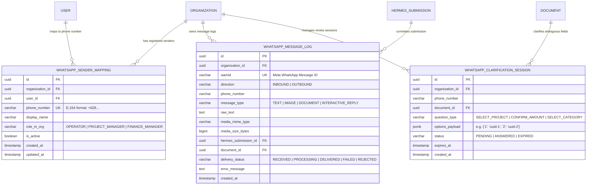

# Data Model: WhatsApp Operational Messaging Integration

**Feature**: `007-whatsapp-integration`  
**Date**: 2026-08-30  
**Governing Documents**:
- [.specify/memory/constitution.md](file:///c:/Projects/financial-saas/.specify/memory/constitution.md)
- [specs/007-whatsapp-integration/spec.md](file:///c:/Projects/financial-saas/specs/007-whatsapp-integration/spec.md)

---

## 1. Entity-Relationship Diagram



---

## 2. Table Specifications

### A. `whatsapp_sender_mappings`

| Column | Type | Constraints | Description |
|---|---|---|---|
| `id` | `UUID` | `PRIMARY KEY`, `DEFAULT gen_random_uuid()` | Unique mapping identifier |
| `organization_id` | `UUID` | `NOT NULL`, `REFERENCES organizations(id)` | Multi-tenant owner organization |
| `user_id` | `UUID` | `NOT NULL`, `REFERENCES users(id)` | Authoritative SaaS user principal |
| `phone_number` | `VARCHAR(32)` | `NOT NULL`, `UNIQUE` | International E.164 phone number |
| `display_name` | `VARCHAR(128)` | `NOT NULL` | Human-readable name for logging & chat |
| `role_in_org` | `VARCHAR(32)` | `NOT NULL` | Role permission (`OPERATOR`, `PROJECT_MANAGER`, `FINANCE_MANAGER`) |
| `is_active` | `BOOLEAN` | `NOT NULL`, `DEFAULT true` | Soft-disable flag |
| `created_at` | `TIMESTAMP WITH TIME ZONE` | `NOT NULL`, `DEFAULT NOW()` | Record creation timestamp |
| `updated_at` | `TIMESTAMP WITH TIME ZONE` | `NOT NULL`, `DEFAULT NOW()` | Last update timestamp |

**Indexes**:
- `idx_wa_sender_phone` on `(phone_number)`
- `idx_wa_sender_org` on `(organization_id, is_active)`

---

### B. `whatsapp_message_logs`

| Column | Type | Constraints | Description |
|---|---|---|---|
| `id` | `UUID` | `PRIMARY KEY`, `DEFAULT gen_random_uuid()` | Unique log identifier |
| `organization_id` | `UUID` | `NOT NULL`, `REFERENCES organizations(id)` | Multi-tenant tenant identifier |
| `wamid` | `VARCHAR(128)` | `NOT NULL`, `UNIQUE` | WhatsApp message identifier for idempotency |
| `direction` | `VARCHAR(16)` | `NOT NULL` | `INBOUND` or `OUTBOUND` |
| `phone_number` | `VARCHAR(32)` | `NOT NULL` | Target/source phone number |
| `message_type` | `VARCHAR(32)` | `NOT NULL` | `TEXT`, `IMAGE`, `DOCUMENT`, `INTERACTIVE_REPLY` |
| `raw_text` | `TEXT` | `NULLABLE` | Sanitized caption or message text |
| `media_mime_type` | `VARCHAR(64)` | `NULLABLE` | Ingested media content type |
| `media_size_bytes` | `BIGINT` | `NULLABLE` | File size in bytes |
| `hermes_submission_id` | `UUID` | `NULLABLE`, `REFERENCES hermes_submissions(id)` | Traceable Hermes orchestration record |
| `document_id` | `UUID` | `NULLABLE`, `REFERENCES documents(id)` | Created Feature 005 document |
| `delivery_status` | `VARCHAR(32)` | `NOT NULL` | `RECEIVED`, `PROCESSING`, `DELIVERED`, `FAILED`, `REJECTED` |
| `error_message` | `TEXT` | `NULLABLE` | Non-sensitive error description |
| `created_at` | `TIMESTAMP WITH TIME ZONE` | `NOT NULL`, `DEFAULT NOW()` | Timestamp of log event |

**Indexes**:
- `idx_wa_log_wamid` on `(wamid)`
- `idx_wa_log_org_created` on `(organization_id, created_at DESC)`
- `idx_wa_log_phone` on `(phone_number)`

---

### C. `whatsapp_clarification_sessions`

| Column | Type | Constraints | Description |
|---|---|---|---|
| `id` | `UUID` | `PRIMARY KEY`, `DEFAULT gen_random_uuid()` | Unique session identifier |
| `organization_id` | `UUID` | `NOT NULL`, `REFERENCES organizations(id)` | Tenant identifier |
| `phone_number` | `VARCHAR(32)` | `NOT NULL` | Phone number engaged in clarification |
| `document_id` | `UUID` | `NOT NULL`, `REFERENCES documents(id)` | Document requiring disambiguation |
| `question_type` | `VARCHAR(32)` | `NOT NULL` | `SELECT_PROJECT`, `CONFIRM_AMOUNT`, `SELECT_CATEGORY` |
| `options_payload` | `JSONB` | `NOT NULL` | Numeric mapping of choices (e.g. `{"1": "uuid-a", "2": "uuid-b"}`) |
| `status` | `VARCHAR(16)` | `NOT NULL`, `DEFAULT 'PENDING'` | `PENDING`, `ANSWERED`, `EXPIRED` |
| `expires_at` | `TIMESTAMP WITH TIME ZONE` | `NOT NULL` | Session expiry (default: +24h) |
| `created_at` | `TIMESTAMP WITH TIME ZONE` | `NOT NULL`, `DEFAULT NOW()` | Session start timestamp |

**Indexes**:
- `idx_wa_clarification_phone_status` on `(phone_number, status, expires_at)`
- `idx_wa_clarification_doc` on `(document_id)`

---

## 3. State Transitions

### Inbound Message Lifecycle
```text
[Webhook Received]
       │
       ├── wamid already logged? ──► [Respond HTTP 200 OK (Idempotent Skip)]
       │
       ├── Sender not in whatsapp_sender_mappings? ──► [Send Unregistered Reply] ──► [Log REJECTED]
       │
       ├── Sender active?
             │
             ├─► Media (Image/PDF) ──► [Download Media] ──► [Call Hermes API] ──► [Send DOC Receipt Reply] ──► [Log DELIVERED]
             │
             └─► Text / Numeric ──► [Active Clarification Session?]
                                          │
                                          ├── Yes ──► [Validate Choice] ──► [Update Review API] ──► [Mark Session ANSWERED] ──► [Send Thanks Reply]
                                          │
                                          └── No ──► [Process Query/Status] ──► [Send Response] ──► [Log DELIVERED]
```
