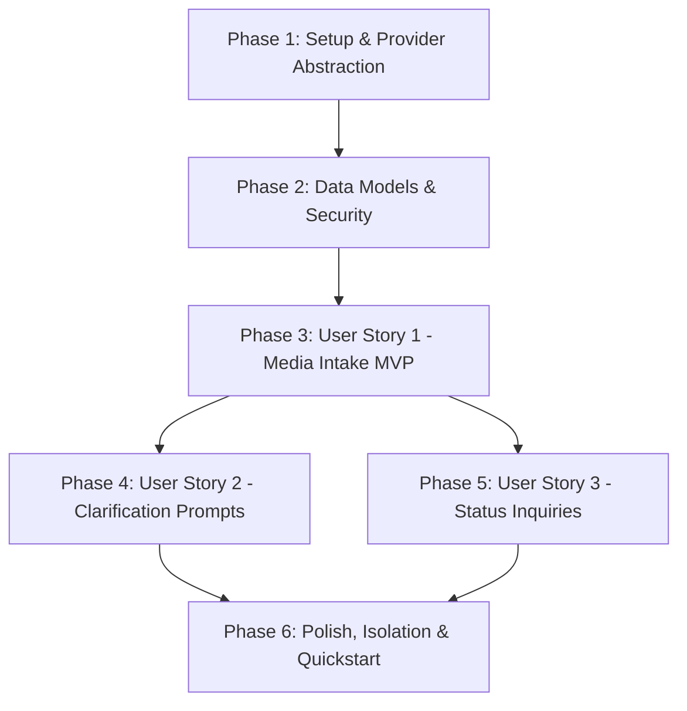

# Implementation Tasks: WhatsApp Operational Messaging Integration

**Feature Branch**: `007-whatsapp-integration`  
**Specification**: [specs/007-whatsapp-integration/spec.md](file:///c:/Projects/financial-saas/specs/007-whatsapp-integration/spec.md)  
**Implementation Plan**: [specs/007-whatsapp-integration/plan.md](file:///c:/Projects/financial-saas/specs/007-whatsapp-integration/plan.md)  
**Research & Decisions**: [specs/007-whatsapp-integration/research.md](file:///c:/Projects/financial-saas/specs/007-whatsapp-integration/research.md)  
**Data Model**: [specs/007-whatsapp-integration/data-model.md](file:///c:/Projects/financial-saas/specs/007-whatsapp-integration/data-model.md)  
**API Contracts**: [specs/007-whatsapp-integration/contracts/](file:///c:/Projects/financial-saas/specs/007-whatsapp-integration/contracts/)  
**Quickstart**: [specs/007-whatsapp-integration/quickstart.md](file:///c:/Projects/financial-saas/specs/007-whatsapp-integration/quickstart.md)

---

## Phase 1: Setup & Provider Abstraction

**Purpose**: Establish WhatsApp configuration settings, abstract provider interfaces, and mock provider simulator for offline testing.

- [X] T001 [P] Configure WhatsApp settings in `backend/src/core/config.py`
- [X] T002 [P] Define `WhatsAppProvider` abstract interface and event DTOs in `backend/src/services/integrations/whatsapp/provider.py`
- [X] T003 [P] Implement `MockWhatsAppProvider` for offline test execution in `backend/src/services/integrations/whatsapp/mock_provider.py`
- [X] T004 [P] Implement `MetaCloudWhatsAppProvider` with Graph API client in `backend/src/services/integrations/whatsapp/meta_provider.py`

---

## Phase 2: Foundational Data Models, Schemas & Security

**Purpose**: Core database tables, Pydantic schemas, and cryptographic HMAC-SHA256 signature verification.

- [X] T005 [P] Define Pydantic request/response schemas in `backend/src/schemas/whatsapp.py`
- [X] T006 [P] Create SQLAlchemy models `WhatsAppSenderMapping`, `WhatsAppMessageLog`, and `WhatsAppClarificationSession` in `backend/src/models/whatsapp.py`
- [X] T007 [P] Create Alembic migration for WhatsApp tables in `backend/alembic/versions/`
- [X] T008 [P] Implement HMAC-SHA256 signature validation utility in `backend/src/services/integrations/whatsapp/security.py`
- [X] T009 [P] Unit test for signature validation and handshake challenge in `backend/tests/unit/test_whatsapp_security.py`

---

## Phase 3: User Story 1 (P1) — Inbound Media Intake & Hermes Bridge 🎯 MVP

**Goal**: Enable field staff to send receipt photos and PDFs via WhatsApp with caption metadata, creating immutable Feature 005 documents via Hermes API.

**Independent Test**: Send mock webhook with photo and caption from a registered number; verify document ingested into Feature 005 and confirmation reply returned.

### Tests for User Story 1
- [X] T010 [P] [US1] Unit test for phone sender mapping and tenant resolver in `backend/tests/unit/test_whatsapp_sender_service.py`
- [X] T011 [P] [US1] Unit test for media stream downloading and MIME validation in `backend/tests/unit/test_whatsapp_media_service.py`
- [X] T012 [P] [US1] Integration test for inbound media webhook and idempotency in `backend/tests/integration/test_whatsapp_intake_flow.py`

### Implementation for User Story 1
- [X] T013 [P] [US1] Implement `WhatsAppSenderService` for phone-to-tenant resolution in `backend/src/services/integrations/whatsapp/sender_service.py`
- [X] T014 [P] [US1] Implement `WhatsAppMediaService` for secure binary streaming in `backend/src/services/integrations/whatsapp/media_service.py`
- [X] T015 [US1] Implement `WhatsAppWebhookService` orchestrating media download and Hermes API forwarding in `backend/src/services/integrations/whatsapp/webhook_service.py`
- [X] T016 [US1] Implement `WhatsAppOutboundService` for dispatching formatted receipt notices in `backend/src/services/integrations/whatsapp/outbound_service.py`
- [X] T017 [US1] Implement webhook GET (handshake) and POST (ingest) endpoints in `backend/src/api/v1/whatsapp.py`
- [X] T018 [US1] Implement admin sender mapping endpoints (`GET /post /delete /senders`) in `backend/src/api/v1/whatsapp.py`

**Checkpoint**: At this point, User Story 1 MVP is fully testable and operational.

---

## Phase 4: User Story 2 (P2) — Interactive Clarification Prompts

**Goal**: Support conversational disambiguation for Review Queue items directly over WhatsApp without exposing accounting ledger controls.

**Independent Test**: Trigger a clarification question for an ambiguous project; reply with valid option number; verify candidate project field updated.

### Tests for User Story 2
- [X] T019 [P] [US2] Unit test for clarification session state machine in `backend/tests/unit/test_whatsapp_clarification.py`
- [X] T020 [P] [US2] Integration test for interactive numeric reply resolving Review Queue candidate in `backend/tests/integration/test_whatsapp_clarification_flow.py`

### Implementation for User Story 2
- [X] T021 [P] [US2] Implement `WhatsAppClarificationService` state machine in `backend/src/services/integrations/whatsapp/clarification_service.py`
- [X] T022 [US2] Wire interactive option dispatching to `WhatsAppOutboundService` in `backend/src/services/integrations/whatsapp/outbound_service.py`
- [X] T023 [US2] Update `WhatsAppWebhookService` to intercept numeric replies and update Review Queue in `backend/src/services/integrations/whatsapp/webhook_service.py`
- [X] T024 [US2] Add clarification session expiry cleanup task in `backend/src/services/integrations/whatsapp/clarification_service.py`

**Checkpoint**: User Stories 1 and 2 are fully functional and testable.

---

## Phase 5: User Story 3 (P3) — Status Inquiries & Operational Summaries

**Goal**: Allow authorized field supervisors to query pending document counts and project statuses via text commands.

**Independent Test**: Send text `"STATUS"` from a registered supervisor number; verify summarized report text returned.

### Tests for User Story 3
- [X] T025 [P] [US3] Unit test for text command parsing and authorization in `backend/tests/unit/test_whatsapp_command_service.py`
- [X] T026 [P] [US3] Integration test for operational status inquiry in `backend/tests/integration/test_whatsapp_status_inquiry.py`

### Implementation for User Story 3
- [X] T027 [US3] Implement `WhatsAppCommandService` parsing commands (`STATUS`, `HELP`, `RINGKASAN`) in `backend/src/services/integrations/whatsapp/command_service.py`
- [X] T028 [US3] Wire command router to `WhatsAppWebhookService` in `backend/src/services/integrations/whatsapp/webhook_service.py`

---

## Phase 6: Polish, Rate Limiting, Multi-Tenant Isolation & Quickstart Verification

**Purpose**: Hardening, denial-of-service protection, strict multi-tenant verification, and execution of Quickstart Scenarios A through F.

- [ ] T029 [P] Implement sliding-window rate limiting middleware in `backend/src/services/integrations/whatsapp/rate_limiter.py`
- [ ] T030 [P] Integration test for multi-tenant data isolation in `backend/tests/integration/test_whatsapp_isolation.py`
- [ ] T031 [P] Integration test for rate limiting enforcement in `backend/tests/unit/test_whatsapp_rate_limiter.py`
- [X] T032 Register WhatsApp API router in `backend/src/api/v1/__init__.py`
- [ ] T033 Execute complete Quickstart verification scenarios A through F per `quickstart.md`
- [ ] T034 [P] Update API documentation and deployment guide in `docs/`

---

## Dependencies & Execution Order

---

## Parallel Execution Opportunities

- **Phase 1**: Configuration (`T001`), Interface (`T002`), Mock Provider (`T003`), and Meta Provider (`T004`) can run concurrently.
- **Phase 2**: Schemas (`T005`), Models (`T006`), and Security Utility (`T008`) can run in parallel.
- **Phase 3**: Tests (`T010–T012`) and component services (`T013–T014`) can run in parallel before webhook orchestrator (`T015`).
- **Phases 4 & 5**: Clarification Prompts (`US2`) and Status Inquiries (`US3`) can be implemented in parallel after Phase 3.
- **Phase 6**: Rate Limiter (`T029`) and Isolation Tests (`T030`) can run in parallel.
