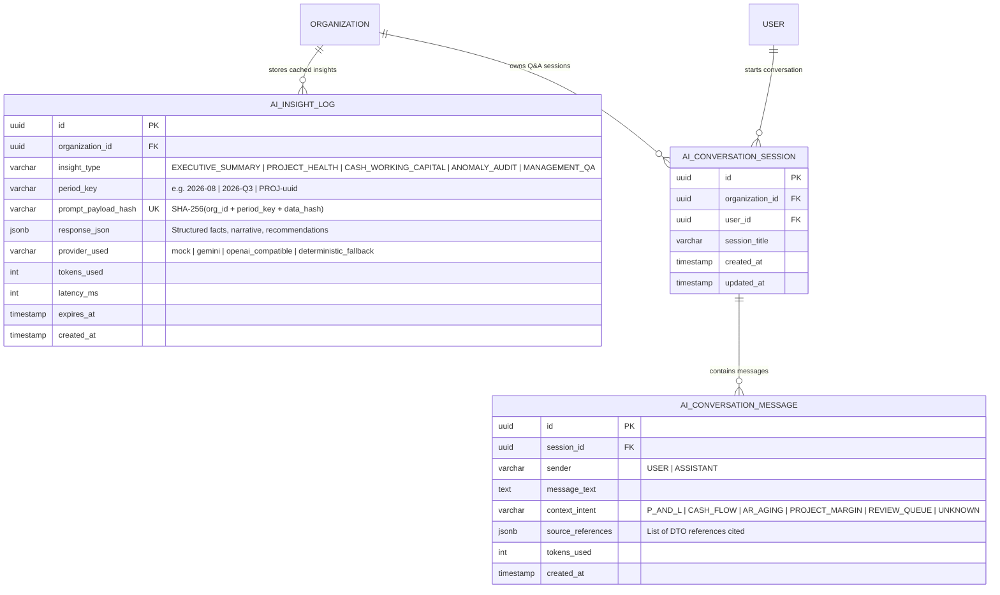

# Data Model: AI-Assisted Management Insights & Decision Support

**Feature**: `008-ai-management-insights`  
**Date**: 2026-08-30  
**Governing Documents**:
- [.specify/memory/constitution.md](file:///c:/Projects/financial-saas/.specify/memory/constitution.md)
- [specs/008-ai-management-insights/spec.md](file:///c:/Projects/financial-saas/specs/008-ai-management-insights/spec.md)

---

## 1. Entity-Relationship Diagram



---

## 2. Table Specifications

### A. `ai_insight_logs`

| Column | Type | Constraints | Description |
|---|---|---|---|
| `id` | `UUID` | `PRIMARY KEY`, `DEFAULT gen_random_uuid()` | Unique log & cache identifier |
| `organization_id` | `UUID` | `NOT NULL`, `REFERENCES organizations(id)` | Multi-tenant tenant identifier |
| `insight_type` | `VARCHAR(32)` | `NOT NULL` | Category of insight |
| `period_key` | `VARCHAR(64)` | `NOT NULL` | Reporting period or project identifier |
| `prompt_payload_hash` | `VARCHAR(64)` | `NOT NULL` | SHA-256 hash for cache matching |
| `response_json` | `JSONB` | `NOT NULL` | Structured payload (headline, facts, narrative, actions) |
| `provider_used` | `VARCHAR(32)` | `NOT NULL` | Provider that generated the response |
| `tokens_used` | `INTEGER` | `NOT NULL`, `DEFAULT 0` | Approximate token count |
| `latency_ms` | `INTEGER` | `NOT NULL`, `DEFAULT 0` | Generation latency in milliseconds |
| `expires_at` | `TIMESTAMP WITH TIME ZONE` | `NOT NULL` | Cache expiration time |
| `created_at` | `TIMESTAMP WITH TIME ZONE` | `NOT NULL`, `DEFAULT NOW()` | Record creation timestamp |

**Indexes**:
- `idx_ai_cache_lookup` on `(organization_id, prompt_payload_hash, expires_at)`
- `idx_ai_insight_org_type` on `(organization_id, insight_type, created_at DESC)`

---

### B. `ai_conversation_sessions`

| Column | Type | Constraints | Description |
|---|---|---|---|
| `id` | `UUID` | `PRIMARY KEY`, `DEFAULT gen_random_uuid()` | Unique session identifier |
| `organization_id` | `UUID` | `NOT NULL`, `REFERENCES organizations(id)` | Tenant identifier |
| `user_id` | `UUID` | `NOT NULL`, `REFERENCES users(id)` | Initiating user principal |
| `session_title` | `VARCHAR(128)` | `NOT NULL` | Conversational topic header |
| `created_at` | `TIMESTAMP WITH TIME ZONE` | `NOT NULL`, `DEFAULT NOW()` | Session start timestamp |
| `updated_at` | `TIMESTAMP WITH TIME ZONE` | `NOT NULL`, `DEFAULT NOW()` | Last update timestamp |

**Indexes**:
- `idx_ai_conv_user` on `(user_id, updated_at DESC)`
- `idx_ai_conv_org` on `(organization_id)`

---

### C. `ai_conversation_messages`

| Column | Type | Constraints | Description |
|---|---|---|---|
| `id` | `UUID` | `PRIMARY KEY`, `DEFAULT gen_random_uuid()` | Unique message identifier |
| `session_id` | `UUID` | `NOT NULL`, `REFERENCES ai_conversation_sessions(id)` | Parent conversation session |
| `sender` | `VARCHAR(16)` | `NOT NULL` | `USER` or `ASSISTANT` |
| `message_text` | `TEXT` | `NOT NULL` | Text content of query or answer |
| `context_intent` | `VARCHAR(32)` | `NULLABLE` | Classified intent category |
| `source_references` | `JSONB` | `NULLABLE` | Authoritative DTOs referenced |
| `tokens_used` | `INTEGER` | `NOT NULL`, `DEFAULT 0` | Tokens consumed for generation |
| `created_at` | `TIMESTAMP WITH TIME ZONE` | `NOT NULL`, `DEFAULT NOW()` | Message timestamp |

**Indexes**:
- `idx_ai_msg_session` on `(session_id, created_at ASC)`

---

## 3. Structured Payload Format (`response_json`)

Every generated insight follows the standard schema:

```json
{
  "headline": "Kinerja keuangan Agustus 2026 solid dengan laba bersih Rp 150 Juta (15%), namun waspadai piutang jatuh tempo > 90 hari.",
  "factual_metrics": {
    "revenue": 1000000000.00,
    "gross_profit": 350000000.00,
    "gross_margin_percentage": 35.0,
    "operating_profit": 200000000.00,
    "net_profit": 150000000.00,
    "cash_balance": 420000000.00,
    "overdue_ar_amount": 85000000.00
  },
  "analytical_narrative": "Pendapatan proyek tumbuh stabil didorong oleh termin Proyek Ruko Thamrin. Beban operasional kantor terkendali di 15% dari total omzet. Namun, likuiditas kas terbebani oleh tagihan customer PT Maju yang telah melewati jatuh tempo 90 hari.",
  "anomalies_detected": [
    {
      "code": "AR_OVERDUE_SURGE",
      "severity": "WARNING",
      "description": "Piutang di atas 90 hari mencapai Rp 85.000.000 (20% dari total piutang)."
    }
  ],
  "actionable_recommendations": [
    "Prioritaskan penagihan intensif untuk invoice PT Maju (INV-008).",
    "Jadwalkan pelunasan utang vendor semen minggu depan setelah termin masuk."
  ],
  "confidence_score": "HIGH",
  "data_as_of": "2026-08-31",
  "provider_metadata": {
    "provider": "gemini",
    "cached": false,
    "latency_ms": 840
  }
}
```
