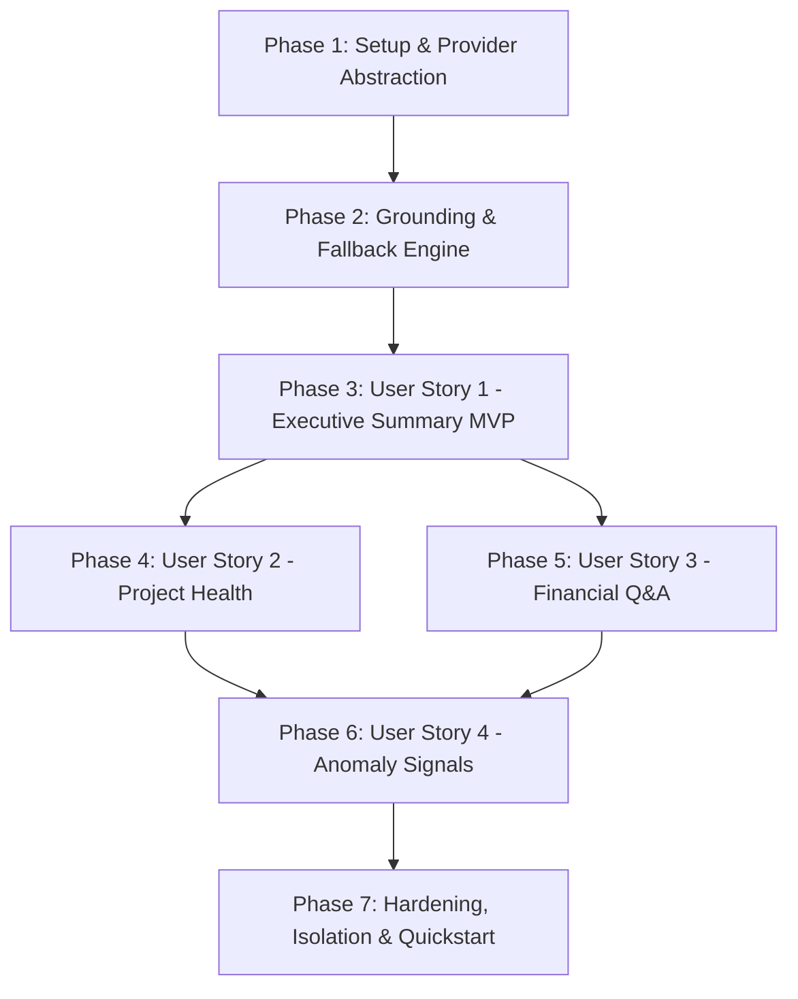

# Implementation Tasks: AI-Assisted Management Insights & Decision Support

**Feature Branch**: `008-ai-management-insights`  
**Specification**: [specs/008-ai-management-insights/spec.md](file:///c:/Projects/financial-saas/specs/008-ai-management-insights/spec.md)  
**Implementation Plan**: [specs/008-ai-management-insights/plan.md](file:///c:/Projects/financial-saas/specs/008-ai-management-insights/plan.md)  
**Research & Decisions**: [specs/008-ai-management-insights/research.md](file:///c:/Projects/financial-saas/specs/008-ai-management-insights/research.md)  
**Data Model**: [specs/008-ai-management-insights/data-model.md](file:///c:/Projects/financial-saas/specs/008-ai-management-insights/data-model.md)  
**API Contracts**: [specs/008-ai-management-insights/contracts/](file:///c:/Projects/financial-saas/specs/008-ai-management-insights/contracts/)  
**Quickstart**: [specs/008-ai-management-insights/quickstart.md](file:///c:/Projects/financial-saas/specs/008-ai-management-insights/quickstart.md)

---

## Phase 1: Setup & Provider Abstraction

**Purpose**: Establish AI configuration settings, provider interface, and mock/live adapters.

- [ ] T001 [P] Configure AI insight settings in `backend/src/core/config.py`
- [ ] T002 [P] Define `AIInsightProvider` abstract base class and DTOs in `backend/src/services/ai/provider.py`
- [ ] T003 [P] Implement `MockAIInsightProvider` for deterministic offline testing in `backend/src/services/ai/mock_provider.py`
- [ ] T004 [P] Implement `GeminiInsightProvider` and `OpenAICompatibleInsightProvider` in `backend/src/services/ai/cloud_providers.py`

---

## Phase 2: Foundational Data Models, Grounding & Fallback Engine

**Purpose**: Database tables, Pydantic DTOs, grounding aggregator from Feature 004, and deterministic fallback summarizer.

- [ ] T005 [P] Define Pydantic request/response schemas in `backend/src/schemas/ai_insight.py`
- [ ] T006 [P] Create SQLAlchemy models `AIInsightLog`, `AIConversationSession`, and `AIConversationMessage` in `backend/src/models/ai_insight.py`
- [ ] T007 [P] Create Alembic migration for AI insight tables in `backend/alembic/versions/`
- [ ] T008 [P] Implement `GroundingService` pulling authoritative DTOs in `backend/src/services/ai/grounding_service.py`
- [ ] T009 [P] Implement `DeterministicFallbackEngine` rule-based heuristic summary in `backend/src/services/ai/fallback_engine.py`
- [ ] T010 [P] Unit test for `DeterministicFallbackEngine` in `backend/tests/unit/test_ai_fallback_engine.py`

---

## Phase 3: User Story 1 (P1) — Executive Financial Summary 🎯 MVP

**Goal**: Deliver executive narrative summary of monthly/quarterly P&L, Balance Sheet, and cash liquidity with zero hallucination.

**Independent Test**: Request executive summary for August 2026; verify revenue and profit figures match backend DTOs exactly.

### Tests for User Story 1
- [ ] T011 [P] [US1] Unit test for executive summary prompt generation and anti-hallucination verification in `backend/tests/unit/test_ai_executive_summary.py`
- [ ] T012 [P] [US1] Integration test for `GET /api/v1/insights/executive-summary` in `backend/tests/integration/test_ai_executive_summary_api.py`

### Implementation for User Story 1
- [ ] T013 [P] [US1] Implement prompt templates for executive summaries in `backend/src/services/ai/prompt_templates.py`
- [ ] T014 [US1] Implement `AIInsightService.get_executive_summary` with SHA-256 caching in `backend/src/services/ai/insight_service.py`
- [ ] T015 [US1] Implement endpoint `GET /api/v1/insights/executive-summary` in `backend/src/api/v1/insights.py`
- [ ] T016 [P] [US1] Implement `ExecutiveSummaryCard` component in `frontend/src/components/ai/ExecutiveSummaryCard.tsx`
- [ ] T017 [US1] Embed `ExecutiveSummaryCard` on Executive Dashboard in `frontend/src/pages/dashboard/DashboardPage.tsx`

**Checkpoint**: User Story 1 MVP fully functional and independently testable.

---

## Phase 4: User Story 2 (P1) — Project Health & Margin Insights

**Goal**: Deliver project profitability insights, 9-category cost breakdown analysis, and clear distinction between accrual profit and cash position.

**Independent Test**: Request project insight for a project with high accrual profit but negative cash flow; verify liquidity warning is generated.

### Tests for User Story 2
- [ ] T018 [P] [US2] Unit test for project margin evaluation and cash vs profit distinction in `backend/tests/unit/test_ai_project_health.py`
- [ ] T019 [P] [US2] Integration test for `GET /api/v1/insights/projects/{project_id}` in `backend/tests/integration/test_ai_project_health_api.py`

### Implementation for User Story 2
- [ ] T020 [P] [US2] Implement prompt templates for project health in `backend/src/services/ai/prompt_templates.py`
- [ ] T021 [US2] Implement `AIInsightService.get_project_health` in `backend/src/services/ai/insight_service.py`
- [ ] T022 [US2] Implement endpoint `GET /api/v1/insights/projects/{project_id}` in `backend/src/api/v1/insights.py`
- [ ] T023 [P] [US2] Implement `ProjectHealthCard` component in `frontend/src/components/ai/ProjectHealthCard.tsx`

---

## Phase 5: User Story 3 (P2) — Natural Language Financial Q&A

**Goal**: Process management questions in Indonesian and return grounded, accurate answers from relevant reporting sub-ledgers.

**Independent Test**: Query "Piutang mana yang kritis?"; verify model quotes invoices over 90 days from `ARAgingReportResponse`.

### Tests for User Story 3
- [ ] T024 [P] [US3] Unit test for `IntentClassifier` in `backend/tests/unit/test_ai_intent_classifier.py`
- [ ] T025 [P] [US3] Integration test for `POST /api/v1/insights/query` in `backend/tests/integration/test_ai_qa_api.py`

### Implementation for User Story 3
- [ ] T026 [P] [US3] Implement `IntentClassifier` routing in `backend/src/services/ai/intent_classifier.py`
- [ ] T027 [US3] Implement `AIInsightService.answer_query` with session persistence in `backend/src/services/ai/insight_service.py`
- [ ] T028 [US3] Implement endpoint `POST /api/v1/insights/query` in `backend/src/api/v1/insights.py`
- [ ] T029 [P] [US3] Implement `FinancialQABox` drawer component in `frontend/src/components/ai/FinancialQABox.tsx`

---

## Phase 6: User Story 4 (P3) — Anomaly Signals & Review Queue Trends

**Goal**: Surface cost spike anomalies and Review Queue bottlenecks for proactive financial control.

**Independent Test**: Feed data with anomalous 300% travel expense spike; verify `UNUSUAL_EXPENSE_SPIKE` signal returned.

### Tests for User Story 4
- [ ] T030 [P] [US3] Unit test for anomaly signal rules in `backend/tests/unit/test_ai_anomaly_detector.py`
- [ ] T031 [P] [US3] Integration test for `GET /api/v1/insights/anomalies` in `backend/tests/integration/test_ai_anomalies_api.py`

### Implementation for User Story 4
- [ ] T032 [US4] Implement heuristic anomaly detector in `backend/src/services/ai/anomaly_detector.py`
- [ ] T033 [US4] Implement endpoint `GET /api/v1/insights/anomalies` in `backend/src/api/v1/insights.py`

---

## Phase 7: Polish, Multi-Tenant Isolation & Quickstart Verification

**Purpose**: Multi-tenant isolation verification, prompt sanitization hardening, and Quickstart Scenarios A through G.

- [ ] T034 [P] Implement prompt injection sanitization filters in `backend/src/services/ai/sanitizer.py`
- [ ] T035 [P] Unit test for prompt injection defense in `backend/tests/unit/test_ai_prompt_sanitization.py`
- [ ] T036 [P] Integration test for strict multi-tenant isolation in `backend/tests/integration/test_ai_isolation.py`
- [ ] T037 [P] Integration test for SHA-256 payload cache hit in `backend/tests/integration/test_ai_caching.py`
- [ ] T038 Register AI Insights API router in `backend/src/api/v1/__init__.py`
- [ ] T039 Implement typed API client in `frontend/src/api/insights.ts`
- [ ] T040 Execute complete Quickstart verification scenarios A through G per `quickstart.md`

---

## Dependencies & Execution Order

---

## Parallel Execution Opportunities

- **Phase 1**: Config (`T001`), Interface (`T002`), Mock Provider (`T003`), Cloud Providers (`T004`) can run concurrently.
- **Phase 2**: Schemas (`T005`), Models (`T006`), Grounding (`T008`), and Fallback Engine (`T009`) can run in parallel.
- **Phase 3**: Prompt templates (`T013`), Unit Tests (`T011`), and Frontend component (`T016`) can run in parallel.
- **Phases 4 & 5**: Project Health (`US2`) and Financial Q&A (`US3`) can be implemented concurrently after Phase 3.
- **Phase 7**: Sanitization (`T034`), Isolation test (`T036`), and Cache test (`T037`) can run in parallel.
